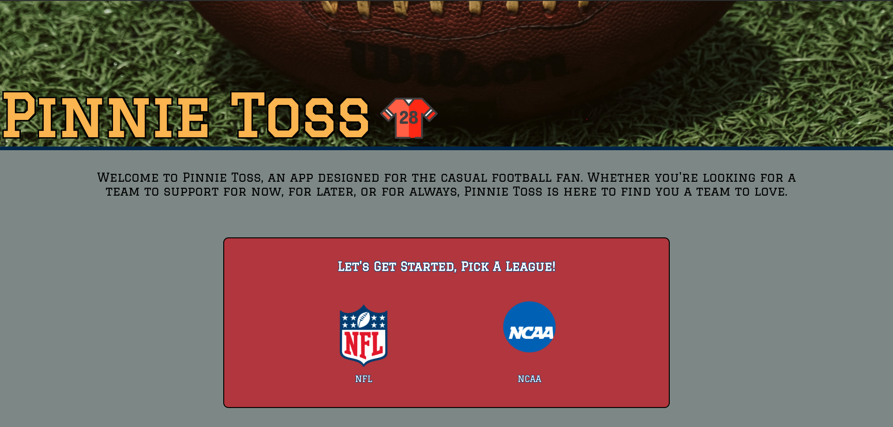
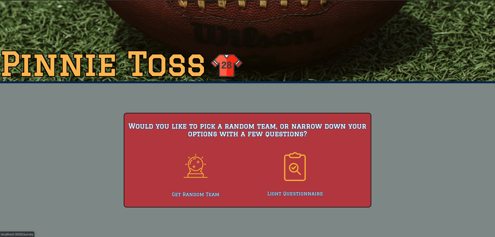
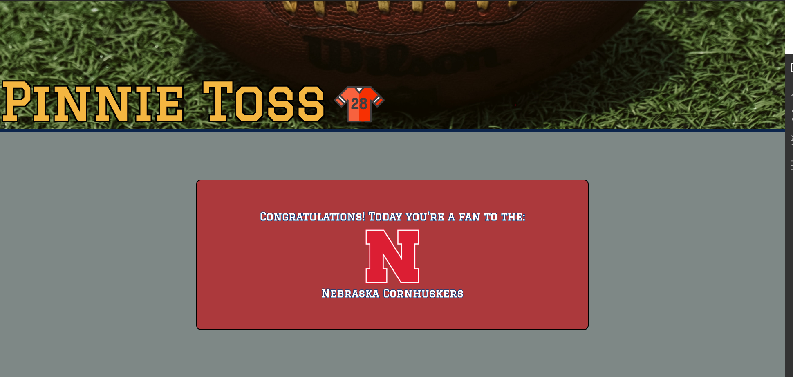
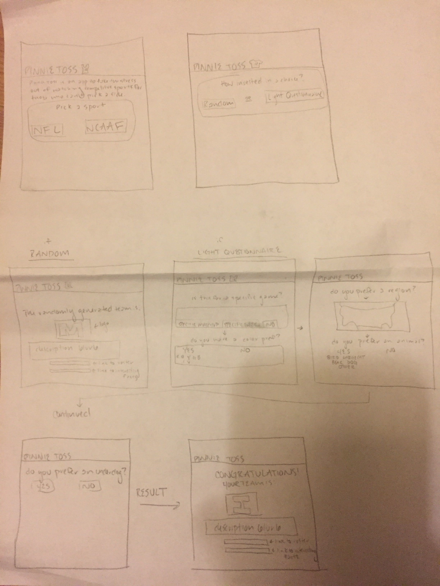

# Pinnie Toss: An App for the Indecisive Sports Enthusiast

Pinnie Toss is a web-based application that is designed for the casual football fan that finds themselves without a clear allegiance to a team, but often in and among devoted sports fans. Based on the user's league preference, "NFL" or "NCAA", the option to randomize or take a survey, and the option to opt for an "underdog" or "winning" team, Pinnie Toss generates a personalized team per the user's preferences.

This was a five-day solo project that incorporated HTML, CSS, ReactJS, React Router, Redux, and Test-Driven Development using Enzyme and Jest. This app was a lot of fun to build, and I plan to continue working on it moving forward. If you'd like to see a plan for future iterations, please visit the GitHub issues page.

## Initial Setup
* Clone down the repo and install the dependencies with `npm install`.
* Run `npm start` and visit http://localhost:3000 to view the application in the browser.
* Run the test suite with `npm test`.

## Learning Objectives
* Make informed design decisions to create a user-friendly application.
* Become comfortable with fetching different network API requests
* Solidify concepts with React to create clean and re-useable components and JSX.
* Become comfortable with Redux’s lifecycle, creating actions, reducers, and connecting them to React components.
* Understand and solidify concepts with React component, asynchronous code, route handling, and Redux testing.

## Built with the Following Libraries, Frameworks, and Tools: 
  * React (`create-react-app`)
  * React Router
  * Functional React components
  * Class React components
  * Redux
  * Testing Jest/Enzyme
  * CSS
  * Fetch API
  * The Sports Database API (https://www.thesportsdb.com/)
  
## Images

### Home Page:

### Pick Method League:

### Survey :

### Initial Display Page:

### WireFrame:

